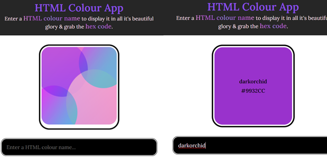
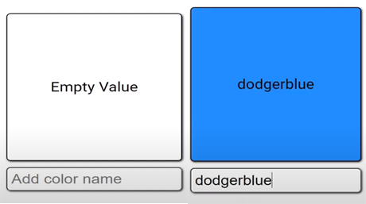
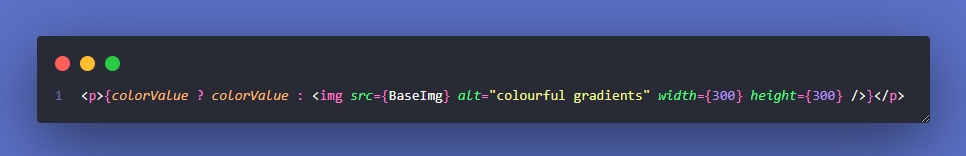
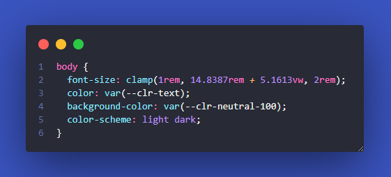

# HTML Colour App

This is version 2.0 of a practice project from [Dave Gray's React Tutorials](https://www.youtube.com/playlist?list=PL0Zuz27SZ-6PrE9srvEn8nbhOOyxnWXfp).

## MVP

Users enter a HTML color name in the input field to see the colour in the box with the html colour name and hex code.

This project gave me an opportunity to practice React techniques learned from the previous 9 videos in the playlist sans-tutorial, including:

- Function Components
- CSS Styles
- useState
- Props
- Controlled Inputs

## Version 2.0

I had fun coding the first version, so I played around an eventually broke it. 😆 I wanted to **display a gradient in the box when the page initially loaded**.

Over three weeks had passed when I began **initializing React apps with Vite and Yarn**, so I decided to give it another go! I rewatched video 10 and found I way to add the gradient!

## Obstacles I Overcame...

1. I noticed I could simply include a gradient image in the **ternary operator**. This paragraph checks if there is a `colorValue`, if there is it displays it's text, or else it will display the gradient image.

2. When the app was displayed in `prefers-color-scheme: dark`, lighter colors were a bit _wonky_ when displayed. Like `yellow` became a muddy brown. After some playing around, I came to this solution:

